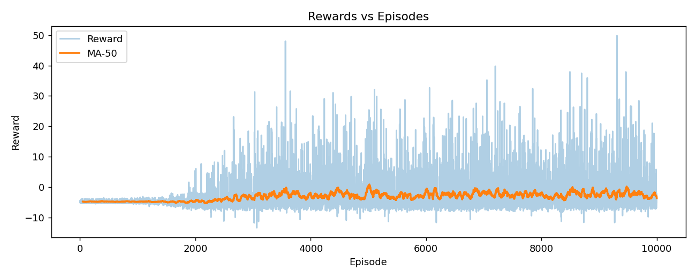
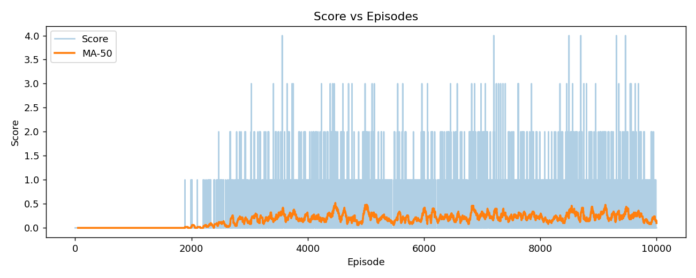
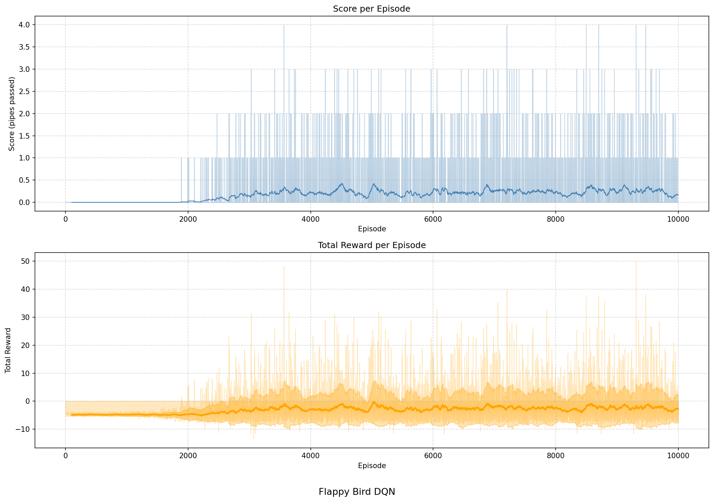

# Flappy Bird AI using Deep Reinforcement Learning (DQN)

An autonomous Flappy Bird agent trained using Deep Q-Networks (DQN) and Reinforcement Learning. The agent learns through trial and error, gradually improving its gameplay by maximizing rewards and avoiding obstacles.

---

## Demo

**Demo Video:**
[Watch Demo](https://drive.google.com/file/d/1_nB6yxbxFGYx8xab85hHzeqDZ8QtbS-1/view?usp=sharing)

---

## Project Highlights

* Developed a custom Flappy Bird environment using Pygame
* Implemented a Deep Q-Network (DQN) agent using PyTorch
* Used Experience Replay and Epsilon-Greedy Exploration
* Trained the agent through reward-based learning
* Saved and evaluated model checkpoints during training
* Visualized learning progress using reward and score metrics
* Achieved autonomous gameplay without human intervention

---

## Technologies Used

| Category               | Technologies         |
| ---------------------- | -------------------- |
| Programming            | Python               |
| Deep Learning          | PyTorch              |
| Reinforcement Learning | Deep Q-Network (DQN) |
| Game Development       | Pygame               |
| Data Processing        | NumPy                |
| Visualization          | Matplotlib           |
| Video Generation       | ImageIO              |

---

## How It Works

The agent interacts with the Flappy Bird environment and repeatedly performs the following cycle:

1. Observe the current game state.
2. Select an action (Flap / No Flap).
3. Receive a reward or penalty.
4. Store experience in replay memory.
5. Update the neural network.
6. Improve future decisions.

Over thousands of episodes, the agent learns strategies that maximize survival time and game score.

---

## Reinforcement Learning Architecture

### State Space

The agent observes information such as:

* Bird position
* Bird velocity
* Distance to the next pipe
* Pipe gap position

### Action Space

The agent chooses between:

* Flap
* Do Nothing

### Reward Function

The reward system encourages:

* Surviving longer
* Passing pipes
* Avoiding collisions

and penalizes:

* Crashing into obstacles
* Hitting the ground or ceiling

### Learning Strategy

The project uses:

* Deep Q-Network (DQN)
* Experience Replay Buffer
* Epsilon-Greedy Exploration
* Mini-Batch Training
* Checkpoint Saving

---

## Training Results

### Rewards vs Episodes



### Score vs Episodes



### Training Performance



The plots show the agent's learning progression across training episodes, demonstrating improved performance as training continues.

---

## Repository Structure

```text
Flappy-Bird-RL-DQN/

├── Code/
│   ├── train.py
│   ├── play.py
│   ├── environment.py
│   ├── dqn_agent.py
│   ├── bird.py
│   ├── pipes.py
│   ├── coin.py
│   ├── enemy_bird.py
│   └── config.py
│
├── Images/
│   ├── rewards_vs_episodes.png
│   ├── score_vs_episodes.png
│   └── score_plot.png
│
├── Models/
│   └── best.pth
│
├── requirements.txt
│
└── README.md
```

---

## Installation

Clone the repository:

```bash
git clone https://github.com/KshitiAnilKumar/Flappy-Bird-RL-DQN.git
cd Flappy-Bird-RL-DQN
```

Install dependencies:

```bash
pip install -r requirements.txt
```

---

## Run Training

```bash
python Code/train.py
```

---

## Run the Trained Agent

```bash
python Code/play.py
```

---

## Model Checkpoint

The repository contains the best-performing trained model:

```text
Models/best.pth
```

which can be loaded directly for evaluation and gameplay.

---

## Key Learning Outcomes

This project demonstrates practical experience with:

* Reinforcement Learning
* Deep Q-Learning (DQN)
* Neural Networks
* Game AI Development
* PyTorch
* Agent Training & Evaluation
* Reward Engineering
* Environment Design

---

## Author

**Kshiti Anil Kumar**

LinkedIn: https://www.linkedin.com/in/kshitianilkumar/

GitHub: https://github.com/KshitiAnilKumar

---

## License

This project is shared for educational and research purposes.
